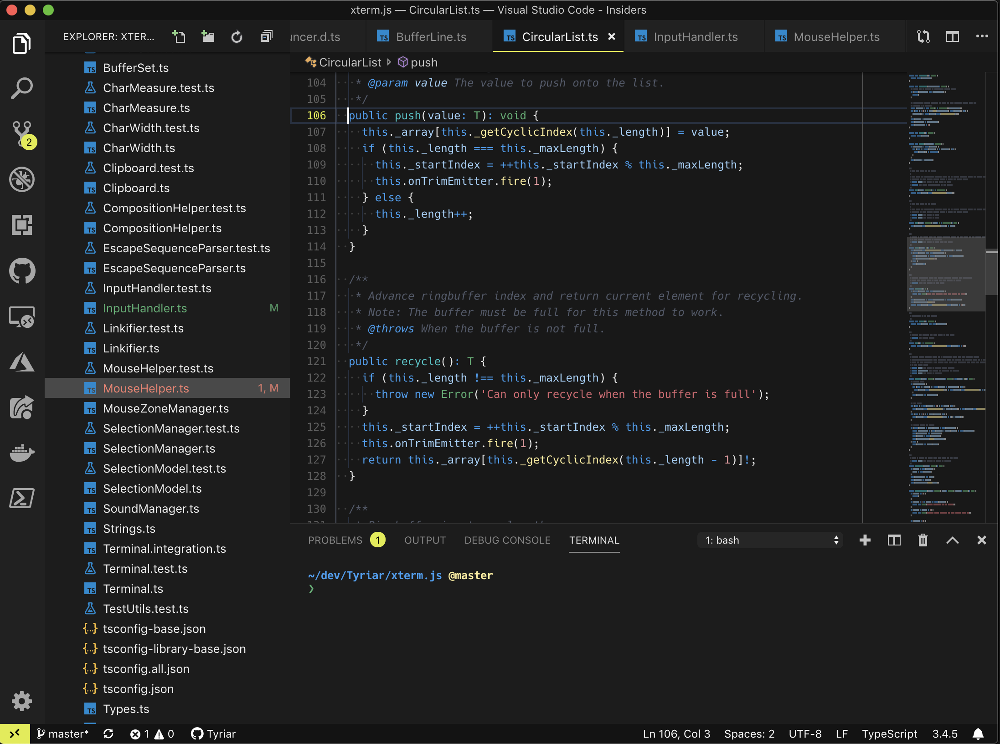

Topaz is a theme for Visual Studio Code featuring vibrant editor colors with a bright yellow primary accent color, created with the help of [vscode-theme-generator](https://github.com/Tyriar/vscode-theme-generator).

This theme customizes colors in the editor, workbench and integrated terminal.

## Semantic colors

Colors in Sapphire have strong meaning.

- **Base color** is light blue
- **Keywords and operators** are blue
- **Classes, functions and member variables** are teal
- **Function calls** are yellow
- **Types** are green
- **Strings** are red
- **Numbers** are orange

If you see any inconsistencies with the colors please report them to the [GitHub repo](https://github.com/Tyriar/vscode-theme-topaz).

## Dim and Bright Variants

The theme also includes a dim and a bright variant.
